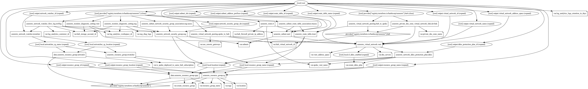

# Azure Virtual Network Spoke Terraform Module

This module deploys a spoke network using the [Microsoft recommended Hub-Spoke network topology](https://docs.microsoft.com/en-us/azure/architecture/reference-architectures/hybrid-networking/hub-spoke). Usually, only one hub in each region with multiple spokes and each of them can also be in separate subscriptions.

>If you are deploying the spoke VNet in the same Hub Network subscription, then make sure you have set the argument `is_spoke_deployed_to_same_hub_subscription = true`. This helps this module to manage the network watcher, flow logs and traffic analytics resources for all the subnets in the Virtual Network. If you are deploying the spoke virtual networks in separate subscriptions, then set this argument to `false`.

This is designed to quickly deploy hub and spoke architecture in the azure and further security hardening would be recommend to add appropriate NSG rules to use this for any production workloads.

These types of resources are supported:

* [Virtual Network](https://www.terraform.io/docs/providers/azurerm/r/virtual_network.html)
* [Subnets](https://www.terraform.io/docs/providers/azurerm/r/subnet.html)
* [Subnet Service Delegation](https://www.terraform.io/docs/providers/azurerm/r/subnet.html#delegation)
* [Virtual Network service endpoints](https://www.terraform.io/docs/providers/azurerm/r/subnet.html#service_endpoints)
* [Private Link service/Endpoint network policies on Subnet](https://www.terraform.io/docs/providers/azurerm/r/subnet.html#enforce_private_link_endpoint_network_policies)
* [AzureNetwork DDoS Protection Plan](https://www.terraform.io/docs/providers/azurerm/r/network_ddos_protection_plan.html)
* [Network Security Groups](https://www.terraform.io/docs/providers/azurerm/r/network_security_group.html)
* [Routing traffic to Hub firewall](https://www.terraform.io/docs/providers/azurerm/r/route_table.html)
* [Peering to Hub Network](https://www.terraform.io/docs/providers/azurerm/r/role_assignment.html)
* [Azure Monitoring Diagnostics](https://www.terraform.io/docs/providers/azurerm/r/monitor_diagnostic_setting.html)
* [Network Watcher](https://www.terraform.io/docs/providers/azurerm/r/network_watcher.html)
* [Network Watcher Workflow Logs](https://www.terraform.io/docs/providers/azurerm/r/network_watcher_flow_log.html)
* [Linking Hub Private DNS Zone](https://www.terraform.io/docs/providers/azurerm/r/private_dns_zone.html)

## Module Usage

```hcl
module "vnet-spoke" {
  source  = "kumarvna/caf-virtual-network-spoke/azurerm"
  version = "1.0.0"

  # By default, this module will create a resource group, proivde the name here
  # to use an existing resource group, specify the existing resource group name,
  # and set the argument to `create_resource_group = false`. Location will be same as existing RG.
  resource_group_name = "rg-spoke-demo-internal-shared-westeurope-001"
  location            = "westeurope"
  spoke_vnet_name     = "default-spoke"

  # Specify if you are deploying the spoke VNet using the same hub Azure subscription
  is_spoke_deployed_to_same_hub_subscription = true

  # Provide valid VNet Address space for spoke virtual network.  
  vnet_address_space = ["10.2.0.0/16"]

  # Hub network details to create peering and other setup
  hub_virtual_network_id          = var.hub_virtual_network_id
  hub_firewall_private_ip_address = "10.1.0.4"
  private_dns_zone_name           = "publiccloud.example.com"
  hub_storage_account_id          = var.hub_storage_account_id

  # (Required) To enable Azure Monitoring and flow logs
  # pick the values for log analytics workspace which created by Hub module
  # Possible values range between 30 and 730
  log_analytics_workspace_id           = var.log_analytics_workspace_id
  log_analytics_customer_id            = var.log_analytics_customer_id
  log_analytics_logs_retention_in_days = 30

  # Multiple Subnets, Service delegation, Service Endpoints, Network security groups
  # These are default subnets with required configuration, check README.md for more details
  # Route_table and NSG association to be added automatically for all subnets listed here.
  # subnet name will be set as per Azure naming convention by defaut. expected value here is: <App or project name>
  subnets = {

    app_subnet = {
      subnet_name           = "applicaiton"
      subnet_address_prefix = ["10.2.1.0/24"]
      service_endpoints     = ["Microsoft.Storage"]

      nsg_inbound_rules = [
        # [name, priority, direction, access, protocol, destination_port_range, source_address_prefix, destination_address_prefix]
        # To use defaults, use "" without adding any value and to use this subnet as a source or destination prefix.
        ["ssh", "200", "Inbound", "Allow", "Tcp", "22", "*", ""],
        ["rdp", "201", "Inbound", "Allow", "Tcp", "3389", "*", ""],
      ]

      nsg_outbound_rules = [
        # [name, priority, direction, access, protocol, destination_port_range, source_address_prefix, destination_address_prefix]
        # To use defaults, use "" without adding any value and to use this subnet as a source or destination prefix.
        ["ntp_out", "103", "Outbound", "Allow", "Udp", "123", "", "0.0.0.0/0"],
      ]
    }

    db_subnet = {
      subnet_name           = "database"
      subnet_address_prefix = ["10.2.2.0/24"]
      service_endpoints     = ["Microsoft.Storage"]
      nsg_inbound_rules = [
        # [name, priority, direction, access, protocol, destination_port_range, source_address_prefix, destination_address_prefix]
        # To use defaults, use "" without adding any value and to use this subnet as a source or destination prefix.
        ["http", "100", "Inbound", "Allow", "Tcp", "80", "*", "0.0.0.0/0"],
        ["sql_port", "101", "Inbound", "Allow", "Tcp", "1433", "*", ""],
      ]

      nsg_outbound_rules = [
        # [name, priority, direction, access, protocol, destination_port_range, source_address_prefix, destination_address_prefix]
        # To use defaults, use "" without adding any value and to use this subnet as a source or destination prefix.
        ["ntp_out", "103", "Outbound", "Allow", "Udp", "123", "", "0.0.0.0/0"],
      ]
    }
  }

  # Adding TAG's to your Azure resources (Required)
  # ProjectName and Env are already declared above, to use them here, create a varible.
  tags = {
    ProjectName  = "demo-internal"
    Env          = "dev"
    Owner        = "user@example.com"
    BusinessUnit = "CORP"
    ServiceClass = "Gold"
  }
}
```

## Create resource group

By default, this module will create a resource group and the name of the resource group to be given in an argument `resource_group_name`. If you want to use an existing resource group, specify the existing resource group name, and set the argument to `create_resource_group = false`.

> *If you are using an existing resource group, then this module uses the same resource group location to create all resources in this module.*

## Azure Network DDoS Protection Plan

By default, this module will not create a DDoS Protection Plan. You can enable/disable it by appending an argument `create_ddos_plan`. If you want to enable a DDoS plan using this module, set argument `create_ddos_plan = true`

## Custom DNS servers

This is an optional feature and only applicable if you are using your own DNS servers superseding default DNS services provided by Azure.Set the argument `dns_servers = ["4.4.4.4"]` to enable this option. For multiple DNS servers, set the argument `dns_servers = ["4.4.4.4", "8.8.8.8"]`

## Subnets

This module handles the creation and a list of address spaces for subnets. This module uses `for_each` to create subnets and corresponding service endpoints, service delegation, and network security groups. This module associates the subnets to network security groups as well with additional user-defined NSG rules.  

This module creates 2 subnets by default: Application Subnet and Database Subnet and both subnets route the traffic through the firewall if `hub_firewall_private_ip_address` argument set else all traffic will forward to VNet.

## Virtual Network service endpoints

Service Endpoints allows connecting certain platform services into virtual networks.  With this option, Azure virtual machines can interact with Azure SQL and Azure Storage accounts, as if they’re part of the same virtual network, rather than Azure virtual machines accessing them over the public endpoint.

This module supports enabling the service endpoint of your choosing under the virtual network and with the specified subnet. The list of Service endpoints to associate with the subnet values include: `Microsoft.AzureActiveDirectory`, `Microsoft.AzureCosmosDB`, `Microsoft.ContainerRegistry`, `Microsoft.EventHub`, `Microsoft.KeyVault`, `Microsoft.ServiceBus`, `Microsoft.Sql`, `Microsoft.Storage` and `Microsoft.Web`.

> **Recommendation: It is recommended to set as few service endpoints as possible on Spoke subnets. Storage Endpoint is useful and doesn't clutter the firewall logs. Besides, add other endpoints if those are absolutely necessary.**

```hcl
module "vnet-spoke" {
  source  = "kumarvna/caf-virtual-network-spoke/azurerm"
  version = "1.0.0"

  # .... omitted

  # Multiple Subnets, Service delegation, Service Endpoints
  subnets = {
    mgnt_subnet = {
      subnet_name           = "management"
      subnet_address_prefix = "10.1.2.0/24"

      service_endpoints     = ["Microsoft.Storage"]  
    }
  }

# ....omitted

}
```

## `enforce_private_link_endpoint_network_policies` - Private Link Endpoint on the subnet

Network policies, like network security groups (NSG), are not supported for Private Link Endpoints. In order to deploy a Private Link Endpoint on a given subnet, you must set the `enforce_private_link_endpoint_network_policies` attribute to `true`. This setting is only applicable for the Private Link Endpoint, for all other resources in the subnet access is controlled based via the Network Security Group which can be configured using the `azurerm_subnet_network_security_group_association` resource.

This module Enable or Disable network policies for the private link endpoint on the subnet. The default value is `false`. If you are enabling the Private Link Endpoints on the subnet you shouldn't use Private Link Services as it's conflicts.

```hcl
module "vnet-spoke" {
  source  = "kumarvna/caf-virtual-network-spoke/azurerm"
  version = "1.0.0"

  # .... omitted

  # Multiple Subnets, Service delegation, Service Endpoints
  subnets = {
    mgnt_subnet = {
      subnet_name           = "management"
      subnet_address_prefix = "10.1.2.0/24"
      enforce_private_link_endpoint_network_policies = true

        }
      }
    }
  }

# ....omitted

}
```

## `enforce_private_link_service_network_policies` - private link service on the subnet

In order to deploy a Private Link Service on a given subnet, you must set the `enforce_private_link_service_network_policies` attribute to `true`. This setting is only applicable for the Private Link Service, for all other resources in the subnet access is controlled based on the Network Security Group which can be configured using the `azurerm_subnet_network_security_group_association` resource.

This module Enable or Disable network policies for the private link service on the subnet. The default value is `false`. If you are enabling the Private Link service on the subnet then, you shouldn't use Private Link endpoints as it's conflicts.

```hcl
module "vnet-spoke" {
  source  = "kumarvna/caf-virtual-network-spoke/azurerm"
  version = "1.0.0"

  # .... omitted

  # Multiple Subnets, Service delegation, Service Endpoints
  subnets = {
    mgnt_subnet = {
      subnet_name           = "management"
      subnet_address_prefix = "10.1.2.0/24"
      enforce_private_link_service_network_policies = true

        }
      }
    }
  }

# ....omitted

}
```

## Network Security Groups

By default, the network security groups connected to all subnets and only allow necessary traffic also block everything else (deny-all rule). Use `nsg_inbound_rules` and `nsg_outbound_rules` in this Terraform module to create a Network Security Group (NSG) for each subnet and allow it to add additional rules for inbound flows.

In the Source and Destination columns, `VirtualNetwork`, `AzureLoadBalancer`, and `Internet` are service tags, rather than IP addresses. In the protocol column, Any encompasses `TCP`, `UDP`, and `ICMP`. When creating a rule, you can specify `TCP`, `UDP`, `ICMP` or `*`. `0.0.0.0/0` in the Source and Destination columns represents all addresses.

>*You cannot remove the default rules, but you can override them by creating rules with higher priorities.*

```hcl
module "vnet-spoke" {
  source  = "kumarvna/caf-virtual-network-spoke/azurerm"
  version = "1.0.0"

  # .... omitted

  # Multiple Subnets, Service delegation, Service Endpoints
  subnets = {
    mgnt_subnet = {
      subnet_name           = "application"
      subnet_address_prefix = "10.1.2.0/24"

      nsg_inbound_rules = [
        # [name, priority, direction, access, protocol, destination_port_range, source_address_prefix, destination_address_prefix]
        # To use defaults, use "" without adding any value and to use this subnet as a source or destination prefix.
        ["weballow", "200", "Inbound", "Allow", "Tcp", "80", "*", ""],
        ["weballow1", "201", "Inbound", "Allow", "Tcp", "443", "*", ""],
      ]

      nsg_outbound_rules = [
        # [name, priority, direction, access, protocol, destination_port_range, source_address_prefix, destination_address_prefix]
        # To use defaults, use "" without adding any value and to use this subnet as a source or destination prefix.
        ["ntp_out", "103", "Outbound", "Allow", "Udp", "123", "", "0.0.0.0/0"],
      ]
    }
  }
}
```

## Network Watcher

This module handle the provision of Network Watcher resource by defining `create_network_watcher` variable. It will enable network watcher, flow logs and traffic analytics for all the subnets in the Virtual Network. Since Azure uses a specific naming standard on network watchers, It will create a resource group `NetworkWatcherRG` and adds the location specific resource.

## Azure Monitoring Diagnostics

Platform logs in Azure, including the Azure Activity log and resource logs, provide detailed diagnostic and auditing information for Azure resources and the Azure platform they depend on. Platform metrics are collected by default and typically stored in the Azure Monitor metrics database. This module enables to send all the logs and metrics to either storage account, event hub or Log Analytics workspace.

## Peering to Hub

To peer spoke networks to the hub networks requires the service principal that performs the peering has `Network Contributor` role on hub network. Linking the Spoke to Hub DNS zones, the service principal also needs the `Private DNS Zone Contributor` role on hub network. If Log Analytics workspace is created in hub or another subscription then, the service principal must have `Log Analytics Contributor` role on workspace or a custom role to connect resources to workspace.

## Linking Hub Private DNS Zone

This module facilitates to link the spoke VNet to private DNS preferably created by Hub Module. To create a link to private DNS zone, set the domain name of the private DNS zone with variable `private_dns_zone_name`. This will always set automatic registration of records to `true`.  

## Recommended naming and tagging conventions

Well-defined naming and metadata tagging conventions help to quickly locate and manage resources. These conventions also help associate cloud usage costs with business teams via chargeback and show back accounting mechanisms.

> ### Resource naming

An effective naming convention assembles resource names by using important resource information as parts of a resource's name. For example, using these [recommended naming conventions](https://docs.microsoft.com/en-us/azure/cloud-adoption-framework/ready/azure-best-practices/naming-and-tagging#example-names), a public IP resource for a production SharePoint workload is named like this: `pip-sharepoint-prod-westus-001`.

> ### Metadata tags

When applying metadata tags to the cloud resources, you can include information about those assets that couldn't be included in the resource name. You can use that information to perform more sophisticated filtering and reporting on resources. This information can be used by IT or business teams to find resources or generate reports about resource usage and billing.

The following list provides the recommended common tags that capture important context and information about resources. Use this list as a starting point to establish your tagging conventions.

Tag Name|Description|Key|Example Value|Required?
--------|-----------|---|-------------|---------|
Project Name|Name of the Project for the infra is created. This is mandatory to create a resource names.|ProjectName|{Project name}|Yes
Application Name|Name of the application, service, or workload the resource is associated with.|ApplicationName|{app name}|Yes
Approver|Name Person responsible for approving costs related to this resource.|Approver|{email}|Yes
Business Unit|Top-level division of your company that owns the subscription or workload the resource belongs to. In smaller organizations, this may represent a single corporate or shared top-level organizational element.|BusinessUnit|FINANCE, MARKETING,{Product Name},CORP,SHARED|Yes
Cost Center|Accounting cost center associated with this resource.|CostCenter|{number}|Yes
Disaster Recovery|Business criticality of this application, workload, or service.|DR|Mission Critical, Critical, Essential|Yes
Environment|Deployment environment of this application, workload, or service.|Env|Prod, Dev, QA, Stage, Test|Yes
Owner Name|Owner of the application, workload, or service.|Owner|{email}|Yes
Requester Name|User that requested the creation of this application.|Requestor| {email}|Yes
Service Class|Service Level Agreement level of this application, workload, or service.|ServiceClass|Dev, Bronze, Silver, Gold|Yes
Start Date of the project|Date when this application, workload, or service was first deployed.|StartDate|{date}|No
End Date of the Project|Date when this application, workload, or service is planned to be retired.|EndDate|{date}|No

> This module allows you to manage the above metadata tags directly or as a variable using `variables.tf`. All Azure resources which support tagging can be tagged by specifying key-values in argument `tags`. Tag `ResourceName` is added automatically to all resources.

```hcl
module "vnet-spoke" {
  source  = "kumarvna/caf-virtual-network-spoke/azurerm"
  version = "1.0.0"

  # ... omitted

  tags = {
    ProjectName  = "demo-internal"
    Env          = "dev"
    Owner        = "user@example.com"
    BusinessUnit = "CORP"
    ServiceClass = "Gold"
  }
}
```

## Inputs

Name | Description | Type | Default
---- | ----------- | ---- | -------
`create_resource_group` | Whether to create resource group and use it for all networking resources | string | `true`
`resource_group_name` | The name of the resource group in which resources are created | string | `""`
`location`|The location of the resource group in which resources are created| string | `""`
`spoke_vnet_name`|The name of the spoke virtual network|string | `""`
`is_spoke_deployed_to_same_hub_subscription`|Specify if the Spoke module using the same subscription as Hub|string|`true`
`vnet_address_space`|Virtual Network address space to be used |list|`[]`
`create_ddos_plan` | Controls if DDoS protection plan should be created | string | `"false"`
`dns_servers` | List of DNS servers to use for virtual network | list |`[]`
`subnets`|For each subnet, create an object that contain fields|object|`{}`
`subnet_name`|A name of subnets inside virtual network| object |`{}`
`subnet_address_prefix`|A list of subnets address prefixes inside virtual network|
`delegation`|defines a subnet delegation feature. takes an object as described in the following example|object|`{}`
`service_endpoints`|service endpoints for the virtual subnet|object|`{}`
`nsg_inbound_rule`|network security groups settings - a NSG is always created for each subnet|object|`{}`
`nsg_outbound_rule`|network security groups settings - a NSG is always created for each subnet|object|`{}`
`hub_virtual_network_id`|The Resource id of the Hub Virtual Network|string|`""`
`hub_firewall_private_ip_address`|The Private IP of the Firewall created by Hub Module|string|`""`
`private_dns_zone_name`|The name of the Hub virtual network Private DNS Zone. Must be a valid domain name to enable the resource creation|string|`""`
`use_remote_gateways`|Controls if remote gateways can be used on the local virtual network|string|`false`
`hub_storage_account_id`|The resource id of storage account created by hub module for logs storage|string|`""`
`log_analytics_workspace_id`|Specifies the resource id of the Log Analytics Workspace|string|`""`
`log_analytics_customer_id`|The Workspace (or Customer) ID for the Log Analytics Workspace|string|`""`
`log_analytics_logs_retention_in_days`|The log analytics workspace data retention in days. Possible values range between `30` and `730`|number|`30`
`Tags`|A map of tags to add to all resources|map|`{}`

## Outputs

|Name | Description|
|---- | -----------|
`resource_group_name`|The name of the resource group in which resources are created
`resource_group_id`|The id of the resource group in which resources are created
`resource_group_location`|The location of the resource group in which resources are created
`virtual_network_name`|The name of the virtual network.
`virtual_network_id`|The virtual NetworkConfiguration ID.
`virtual_network_address_space`|List of address spaces that are used the virtual network.
`subnet_ids`|List of IDs of subnets
`subnet_address_prefixes`|List of address prefix for  subnets
`network_security_group_ids`|List of Network security groups and ids
`ddos_protection_plan_id`|Azure Network DDoS protection plan id
`network_watcher_id`|ID of Network Watcher
`route_table_name`|The resource id of the route table
`route_table_id`|The resource id of the route table

## Resource Graph



## Authors

Module is maintained by [Kumaraswamy Vithanala](mailto:kumarvna@gmail.com) with the help from other awesome contributors.

## Other resources

* [Hub-spoke network topology in Azure](https://docs.microsoft.com/en-us/azure/architecture/reference-architectures/hybrid-networking/hub-spoke)
* [Terraform AzureRM Provider Documentation](https://www.terraform.io/docs/providers/azurerm/index.html)
